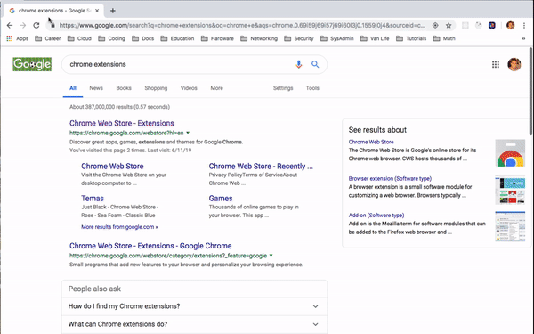
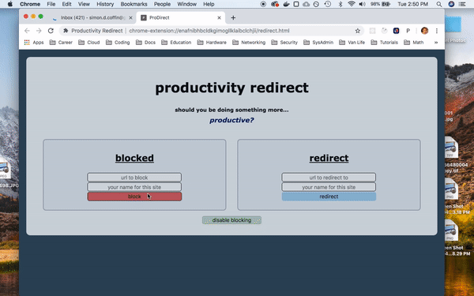
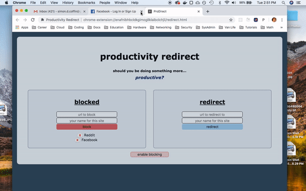

# Productivity-Redirect
Chrome extension for redirecting your url traffic from distracting to productive websites

BRIEF:
  - Block sites so you don't mindlessly start surfing the web without realizing it.
  - Catch and redirect to a landing page with links to more productive sites.
  - Easily disable blocking when you don't need it.
  - This isn't about strict lockouts, more like a momentary interruption to get you back on track,
  
INSTALL:
  - On install a small white square with a "P" will appear to the right of your address bar.
  - Make sure to restart the browser.
  - Then click the "P" to access the Productivity Redirect page.

BLOCKING:
  - Navigate to "blocked" column on left.
  - Add full and valid URL of website to be blocked.
    - That URL and any additional paths from it will be blocked and redirected.
  - Enter name for the website.
    - You MUST enter both a URL and website name.
  - Hit block or press enter.
  
  - To remove a site press the red "X" button to the left of the site name.
  

  
REDIRECTING:
  - Navigate to "redirect" column on right.
  - Add full and valid URL of website to redirect to.
  - Enter name for the website.
    - You MUST enter both a URL and website name.
  - Hit redirect or press enter.
  
  - To remove a site press the red "X" button to the left of the site name.
  
  - Website names listed below are active hyperlinks.
    - Click one to redirect to the URL it represents.
    

    
BLOCKING STATUS:
  - Press button at bottom of page to change blocking status.
  - You can enable or disable blocking at any time without affecting your list of sites.
  

Enjoy!
